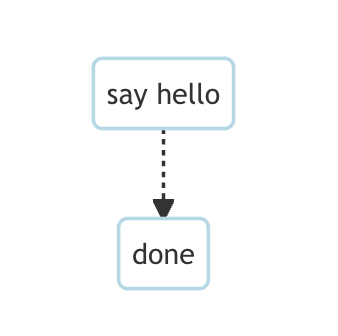

# Examples

- [Examples](#examples)
  - [Hello World](#hello-world)
  - [Conditional Steps](#conditional-steps)
  - [Writing to Files](#writing-to-files)
  - [Passing output to the next step](#passing-output-to-the-next-step)
  - [Running Docker Containers](#running-docker-containers)
    - [Container Configurations](#container-configurations)
    - [How to run docker containers inside a `dagu` container](#how-to-run-docker-containers-inside-a-dagu-container)
  - [Command Execution over SSH](#command-execution-over-ssh)
  - [Making HTTP Requests](#making-http-requests)
  - [Sending Email Notification](#sending-email-notification)
  - [Customizing Signal on Stop](#customizing-signal-on-stop)
- [How to contribute?](#how-to-contribute)

## Hello World



```yaml
name: hello world
steps:
  - name: "hello"
    command: echo hello world
  - name: "done"
    command: echo done!
    depends:
      - "1"
```

## Conditional Steps


```yaml
params: foo
steps:
  - name: "step1"
    command: echo start
  - name: "foo"
    command: echo foo
    depends:
      - "step1"
    preconditions:
      - condition: "$1"
        expected: foo
  - name: "bar"
    command: echo bar
    depends:
      - "step1"
    preconditions:
      - condition: "$1"
        expected: bar
```

## Writing to Files

```yaml
steps:
  - name: write hello to '/tmp/hello.txt'
    command: echo hello
    stdout: /tmp/hello.txt
```

## Passing output to the next step


```yaml
steps:
  - name: pass 'hello'
    command: echo hello
    output: OUT1
  - name: output 'hello world'
    command: bash
    script: |
      echo $OUT1 world
    depends:
      - pass 'hello'
```

## Running Docker Containers

```yaml
steps:
  - name: deno_hello_world
    executor: 
      type: docker
      config:
        image: "denoland/deno:1.10.3"
        host:
          autoRemove: true
    command: run https://examples.deno.land/hello-world.ts
```

Example Log output


You can configure the Docker host with the environment variable `DOCKER_HOST`.

For example:
```yaml
env:
  - DOCKER_HOST : "tcp://XXX.XXX.XXX.XXX:2375"
steps:
  - name: deno_hello_world
    executor: 
      type: docker
      config:
        image: "denoland/deno:1.10.3"
        autoRemove: true
    command: run https://examples.deno.land/hello-world.ts
```

### Container Configurations

You can config the Docker container (e.g., `volumes`, `env`, etc) by passing more detailed options.

For example:
```yaml
steps:
  - name: deno_hello_world
    executor: 
      type: docker
      config:
        image: "denoland/deno:1.10.3"
        container:
          volumes:
            /app:/app:
          env:
            - FOO=BAR
        host:
          autoRemove: true
    command: run https://examples.deno.land/hello-world.ts
```

See the Docker's API documentation for all available options.

- For `container`, see [ContainerConfig](https://pkg.go.dev/github.com/docker/docker/api/types/container#Config).
- For `host`, see [HostConfig](https://pkg.go.dev/github.com/docker/docker/api/types/container#HostConfig).

### How to run docker containers inside a `dagu` container

If you are running `dagu` using a container, you need the setup below.

1. Run a `socat` conainer with the command below.

```sh
docker run -v /var/run/docker.sock:/var/run/docker.sock -p 2376:2375 bobrik/socat TCP4-LISTEN:2375,fork,reuseaddr UNIX-CONNECT:/var/run/docker.sock
```

2. Then you can set the `DOCKER_HOST` environment as follows.

```yaml
env:
  - DOCKER_HOST : "tcp://host.docker.internal:2376"
steps:
  - name: deno_hello_world
    executor: 
      type: docker
      config:
        image: "denoland/deno:1.10.3"
        autoRemove: true
    command: run https://examples.deno.land/hello-world.ts
```

For more details, see [this page](https://forums.docker.com/t/remote-api-with-docker-for-mac-beta/15639/2).

## Command Execution over SSH

```yaml
steps:
  - name: print ec2 instance id
    executor: 
      type: ssh
      config:
        user: ec2-user
        ip: "XXX.XXX.XXX.XXX"
        key: /Users/XXXXX/.ssh/prod-ec2instance-keypair.pem
        StrictHostKeyChecking: false
    command: ec2-metadata -i

```

## Making HTTP Requests

```yaml
steps:
  - name: get fake json data
    executor: http
    command: GET https://jsonplaceholder.typicode.com/comments
    script: |
      {
        "timeout": 10,
        "headers": {},
        "query": {
          "postId": "1"
        },
        "body": ""
      }      
```

## Sending Email Notification

Email example


```yaml
steps:
  - name: Sending Email on Finish or Error
    command: echo "hello world"

mailOn:
  failure: true
  success: true

smtp:
  host: "smtp.foo.bar"
  port: "587"
  username: "<username>"
  password: "<password>"
errorMail:
  from: "foo@bar.com"
  to: "foo@bar.com"
  prefix: "[Error]"
infoMail:
  from: "foo@bar.com"
  to: "foo@bar.com"
  prefix: "[Info]"
```

## Customizing Signal on Stop

```yaml
steps:
  - name: step1
    command: bash
    script: |
      for s in {1..64}; do trap "echo trap $s" $s; done
      sleep 60
    signalOnStop: "SIGINT"
```

# How to contribute?

Feel free to contribute interesting examples in this page. Thanks!
